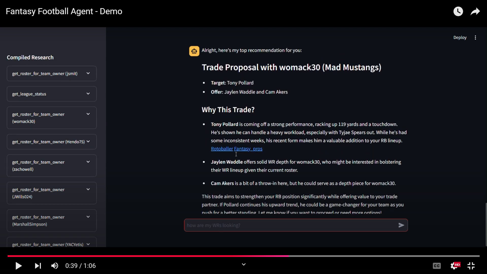

## Fantasy Football Chatbot

This repo contains a full-stack application covering integration with the Sleeper API, creation of a Streamlit UI, and deployment via AWS CDK.

For the full details, check out the article in [Towards Data Science](https://towardsdatascience.com/building-a-fantasy-football-research-agent-with-langgraph-ad8deb0126f1)!

## Demo Video

## Prerequisites:

- `cp .env.template .env`
- Add relevant keys to `.env`

## Local Deployment

Dependencies:

- Docker
- Python 3.11
- `npm`
- AWS CDK

Steps:

- `cd fantasy_chatbot`
- `python3.11 -m venv venv` (highly recommend using Python 3.11 to avoid unexpected issues)
- Activate the venv (e.g. `. venv/bin/activate`)
- `pip install -r requirements.txt`

There are 2 Dockerfiles in this directory, one for the Streamlit app and one for the LangGraph API server. The LangGraph one was generated via `langgraph dockerfile api.Dockerfile`. We needed to generate this to create a docker asset for the AWS CDK deployment.

- Build LangGraph image with `docker build . -t fantasy-chatbot -f api.Dockerfile`
- `docker compose up` to run the containers for Redis, Postgres, and the API (see `docker-compose.yml`)
- In another terminal, run the streamlit UI with `streamlit run app.py`

The app should now be available locally at `http://localhost:8501`

## Deploy to AWS

- `cd deploy`
- `npm i`
- Deploy the stack with `npm run cdk deploy`
- The URL to the Load Balancer will be available in the Stack Outputs.

